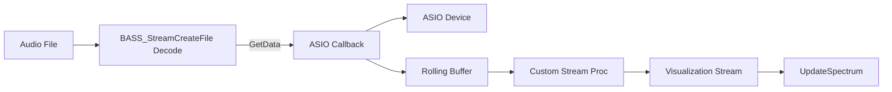

# Audio Device and Output Configuration – ASIO Output Path

This section describes how the application configures and uses ASIO devices for high-performance audio playback while maintaining stable, real-time spectrum visualization. When **global_isasio** is `true`, we route decoded audio directly to ASIO channels via BASSASIO and mirror the data through a parallel custom stream for visualization.

## Device Initialization 🎛️

The application initializes both BASS and BASSASIO to ensure compatibility and API stability:

- **BASS Initialization**

Always call `BASS_Init` (typically using the default or user-specified non-ASIO device) to set up the core audio API .

- **ASIO Device Initialization**

If the user’s **global_audiodevicename** matches an installed ASIO device, **global_isasio** is set to `true` and the ASIO device is initialized:

```cpp
  if (!BASS_ASIO_Init(global_deviceid, BASS_ASIO_THREAD))
      Error("Can't initialize ASIO device");
```

## 1. Decoding-Only Stream

Rather than playing audio directly, the app creates a **decode-only** BASS stream. This isolates raw PCM data for ASIO callbacks:

```cpp
chan = BASS_StreamCreateFile(
    FALSE, filename, 0, 0,
    BASS_SAMPLE_LOOP | BASS_STREAM_DECODE | BASS_SAMPLE_FLOAT
);
```

or for module formats:

```cpp
chan = BASS_MusicLoad(
    FALSE, filename, 0, 0,
    BASS_SAMPLE_LOOP | BASS_STREAM_DECODE | BASS_SAMPLE_FLOAT | BASS_MUSIC_PRESCAN,
    0
);
```

This stream provides decoded floating-point samples on demand without playing them directly .

## 2. ASIO Processing Callback – `AsioProc`

The **AsioProc** function feeds the ASIO device by pulling data from the decode-only stream and buffering it:

```cpp
DWORD CALLBACK AsioProc(
    BOOL input, DWORD channel,
    void *buffer, DWORD length, void *user
) {
    DWORD c = BASS_ChannelGetData((DWORD)user, buffer, length);
    if (c == -1) c = 0;

    if (c < asiobuflen) {
        memmove(asiobuf, asiobuf + c, asiobuflen - c);
        memcpy(asiobuf + asiobuflen - c, buffer, c);
    } else {
        memcpy(asiobuf, buffer, asiobuflen);
    }
    return c;
}
```

- **BASS_ChannelGetData** pulls samples from the decode stream.
- A rolling buffer **asiobuf** of size **asiobuflen** always holds the latest waveform history.

## 3. Custom Visualization Stream – `bufstream`

To avoid stealing data from ASIO playback, a second BASS stream mirrors **asiobuf** for spectrum updates:

1. **Creation**

```cpp
   bufstream = BASS_StreamCreate(
       global_BASS_CHANNELINFO.freq,
       global_BASS_CHANNELINFO.chans,
       BASS_SAMPLE_FLOAT | BASS_STREAM_DECODE,
       BufStreamProc, 0
   );
```

1. **Stream Procedure**

```cpp
   DWORD CALLBACK BufStreamProc(
       HSTREAM handle, void *buffer, DWORD length, void *user
   ) {
       if (length > asiobuflen) length = asiobuflen;
       memcpy(buffer, asiobuf, length);
       return length;
   }
```

This allows the visualization code to call `BASS_ChannelGetData(bufstream, …)` without affecting ASIO output  .

## 4. Channel Routing and Format

ASIO output channels are configured to route the decoded stream via **AsioProc**:

| Operation | Function Call | Purpose |
| --- | --- | --- |
| Enable output channel | `BASS_ASIO_ChannelEnable(0, selector, AsioProc, (void*)chan)` | Route stream to ASIO channel |
| Join channels for stereo | `BASS_ASIO_ChannelJoin(0, rightSel, leftSel)` | Mirror left to right |
| Mirror mono to stereo | `BASS_ASIO_ChannelEnableMirror(1, 0, 0)` | Duplicate mono channel |
| Force float format | `BASS_ASIO_ChannelSetFormat(0, selector, BASS_ASIO_FORMAT_FLOAT)` | Ensure 32-bit float processing |
| Set sample rate | `BASS_ASIO_ChannelSetRate(0, selector, freq)`<br>`BASS_ASIO_SetRate(freq)` | Align ASIO and stream sampling rates |
| Start ASIO output | `BASS_ASIO_Start(0)` | Begin ASIO playback |


```cpp
if (!BASS_ASIO_ChannelEnable(0, global_outputAudioChannelSelectors[0],
                             AsioProc, (void*)chan))
    Error("BASS_ASIO_ChannelEnable fails");
// ... join, mirror, set format & rate ...
if (!BASS_ASIO_Start(0))
    Error("Can't start ASIO output");
```

## 5. Starting ASIO Output ▶️

After routing and format setup, the application calls:

```cpp
BASS_ASIO_Start(0);
```

Playback now runs in the BASSASIO thread with default buffering. The ASIO callback is invoked at each buffer period .

## 6. Spectrum Visualization

The timer-driven **UpdateSpectrum** routine reads from **bufstream** when ASIO is active:

```cpp
if (global_isasio)
    BASS_ChannelGetData(bufstream, buf, BASS_DATA_FLOAT | FFTSIZE);
else
    BASS_ChannelGetData(chan, buf, BASS_DATA_FLOAT | FFTSIZE);
```

This approach decouples rendering updates from the playback buffer, ensuring a smooth spectrum without dropping ASIO data.



**Key Takeaways**

- **Parallel streams** isolate playback from visualization.
- **Rolling buffer** ensures no data loss.
- **ASIO routing** delivers low-latency output.
- **Custom stream** provides stable FFT data for display.