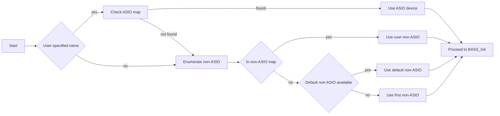

## Audio Device and Output Configuration - Automatic Device Selection Logic

This section details how the application automatically selects the appropriate audio output device—favoring a user‐specified ASIO device when available, and gracefully falling back to standard (non-ASIO) devices otherwise. The selection occurs **before** initializing BASS/BASSASIO, ensuring all subsequent calls use the chosen device index and mode.

### 🎛️ Building the ASIO Device Map

The application first enumerates all available ASIO drivers and builds a lookup map:

```cpp
BASS_ASIO_DEVICEINFO info;
for (int i = 0; BASS_ASIO_GetDeviceInfo(i, &info); i++) {
    std::string name = info.name;
    global_asiodevicemap.insert({ name, i });
}
```

- Uses `BASS_ASIO_GetDeviceInfo(i, &info)` to query each ASIO device by index.
- Populates `global_asiodevicemap` mapping the **device name** to its **ASIO index**.

### Matching a Requested ASIO Device

If the user provides a device name (`global_audiodevicename`), the logic attempts an ASIO match:

```cpp
auto it = global_asiodevicemap.find(global_audiodevicename);
if (!global_audiodevicename.empty() && it != global_asiodevicemap.end()) {
    global_deviceid = it->second;
    global_isasio   = true;
    printf("using installed asio audio device\n");
}
```

- **Success** sets `global_deviceid` to the ASIO index and `global_isasio = true`, skipping non-ASIO enumeration.

```card
{
    "title": "ASIO Priority",
    "content": "If a user-specified ASIO device is found, non-ASIO enumeration is skipped."
}
```

### 🔄 Enumerating Non-ASIO Devices

When no matching ASIO device is found, the application falls back to standard Windows audio outputs:

```cpp
global_isasio = false;
BASS_DEVICEINFO devinfo;
for (int i = 0; BASS_GetDeviceInfo(i, &devinfo); i++) {
  if (devinfo.flags & BASS_DEVICE_ENABLED) {
    std::string name = devinfo.name;
    global_nonasiodevicemap.insert({ name, i });
    if (devinfo.flags & BASS_DEVICE_DEFAULT) {
      global_audiodevicename_default = name;
      global_deviceid               = i;
    }
  }
}
```

- **BASS_DEVICE_ENABLED** devices are listed for selection.
- The first **default** device (`BASS_DEVICE_DEFAULT`) is tracked as a candidate.

#### BASS Device Flags

| Flag | Value | Description |
| --- | --- | --- |
| BASS_DEVICE_ENABLED | 1 | Device can be used |
| BASS_DEVICE_DEFAULT | 2 | System’s default playback device |
| BASS_DEVICE_INIT | 4 | Device supports initialization |
| BASS_DEVICE_LOOPBACK | 8 | Device captures loopback (recording) |


*Source: bass.h header definitions *

### Final Non-ASIO Device Selection

Having built the non-ASIO map, the logic chooses the final device in this order:

```cpp
auto it2 = global_nonasiodevicemap.find(global_audiodevicename);
if (!global_audiodevicename.empty() && it2 != global_nonasiodevicemap.end()) {
  // 1. User-specified non-ASIO
  global_deviceid = it2->second;
}
else if (!global_audiodevicename_default.empty()
      && (it2 = global_nonasiodevicemap.find(global_audiodevicename_default))
         != global_nonasiodevicemap.end()) {
  // 2. Default non-ASIO
  global_deviceid = it2->second;
}
else {
  // 3. Fallback to first real device
  global_deviceid = 1;
  printf("using first non-asio audio device id = %d\n", global_deviceid);
}
```

- **Priority**: user name → default device → device ID 1
- Logs each decision for debugging or audit.

### Selection Logic Flowchart



### Integration with BASS/BASSASIO Initialization

The selected `global_deviceid` and `global_isasio` govern the subsequent initialization:

```cpp
// In WM_CREATE handler
if (!global_isasio) {
  if (!BASS_Init(global_deviceid, 44100, 0, win, nullptr))
    Error("Can't initialize device");
}
else {
  // ASIO uses default init with BASS_ASIO_Init later
  if (!BASS_Init(-1, 44100, 0, win, nullptr))
    Error("Can't initialize default device with ASIO");
}
```

- Uses **global_deviceid** when `global_isasio == false`.
- ASIO initialization (`BASS_ASIO_Init(global_deviceid, BASS_ASIO_THREAD)`) follows after stream setup.

This logic ensures the application adapts seamlessly to both professional ASIO setups and everyday sound cards, providing robust device selection and predictable behavior.