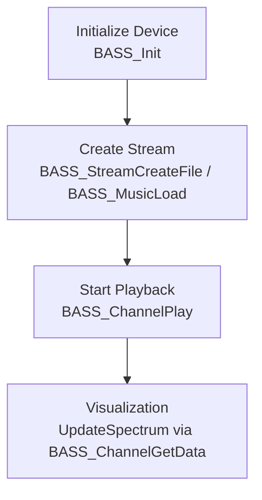

# 🔈 Audio Device and Output Configuration – Non-ASIO Output Path

This section describes how the player initializes and uses BASS’s standard output when `global_isasio == false`. It covers device initialization, audio stream creation, playback, and how visualization hooks into the same channel.

## Device Initialization

Before playing any audio, the application must initialize the chosen output device at a fixed sample rate.

- **Function call**:

```cpp
  BASS_Init(global_deviceid, 44100, 0, win, NULL)
```

- **Parameters**:
- `global_deviceid`: Index of the selected non-ASIO device.
- `44100`: Output sample rate (44.1 kHz).
- `0`: No special device flags.
- `win`: Handle to the main window (for error messages).
- `NULL`: No custom device GUID.
- **Error handling**:
- On failure, `Error("Can't initialize device")` displays a message box.
- Logs the device ID to a debug file if `pFILE` is set.

```cpp
if (global_isasio == false) {
    if (!BASS_Init(global_deviceid, 44100, 0, win, NULL)) {
        Error("Can't initialize device");
        if (pFILE) {
            fprintf(pFILE, "Error, cannot initialize device %d\n", global_deviceid);
        }
        return -1;
    }
}
```

## Stream Creation

Once the device is initialized, the player attempts to load the audio file using two methods in order:

1. **Looped floating-point stream**
2. **Module/tracker format loader**

Both methods use flags to control looping, precision, and pre-scanning.

```cpp
if (global_isasio == false) {
    if (!(chan = BASS_StreamCreateFile(
            FALSE, filename, 0, 0,
            BASS_SAMPLE_LOOP
          | BASS_SAMPLE_FLOAT
          | BASS_STREAM_PRESCAN))
     && !(chan = BASS_MusicLoad(
            FALSE, filename, 0, 0,
            BASS_SAMPLE_LOOP
          | BASS_SAMPLE_FLOAT
          | BASS_MUSIC_RAMPS
          | BASS_MUSIC_PRESCAN,
            0))) {
        Error("Can't play file");
        return FALSE;
    }
}
```

### Flag Summary

| Flag | Purpose |
| --- | --- |
| **BASS_SAMPLE_LOOP** | Enable seamless looping of the audio. |
| **BASS_SAMPLE_FLOAT** | Use 32-bit floating-point samples for high precision. |
| **BASS_STREAM_PRESCAN** | Pre-scan files to determine exact length and enable seeking. |
| **BASS_MUSIC_RAMPS** | Apply volume ramping for smoother module transitions. |
| **BASS_MUSIC_PRESCAN** | Pre-scan module formats for length and seek accuracy. |


## Playback & Visualization

After successfully creating a stream or loading a module, the application:

1. **Calculates playback duration** if `global_fSecondsPlay <= 0`.
2. **Starts a one-shot timer** to stop playback after the determined duration.
3. **Begins playback** on the same channel used for visualization.

```cpp
// Start a timer to auto-stop playback
global_timer = timeSetEvent(
    global_fSecondsPlay * 1000, 25,
    (LPTIMECALLBACK)&StopPlayingFile,
    0, TIME_ONESHOT
);

if (global_isasio == false) {
    BASS_ChannelPlay(chan, FALSE);
}
```

The `**chan**` handle is later used in `UpdateSpectrum` to pull FFT or waveform data from the same BASS channel, ensuring synchronized audio and visualization.

## Process Flow

Below is a simplified flowchart of the non-ASIO output path:



## Key Points

- **Modular loading fallback** ensures both common audio files and tracker modules are supported.
- **Floating-point processing** avoids quantization during FFT and waveform extraction.
- **Pre-scanning** enables accurate display of track length and precise seeking.
- **Unified channel handle** (`chan`) feeds both output and visualization routines.

This configuration enables reliable playback on any standard Windows audio device without ASIO, while maintaining high-quality spectral analysis and user experience.