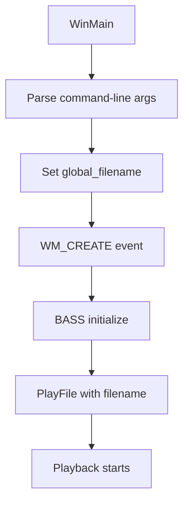

# Audio Playback and File Handling – File Selection Workflows

This section describes how the application selects audio files for playback. Two main patterns exist: command-line file selection (for unattended or scripted use) and a runtime file-open dialog (for interactive selection).

---

## 🚀 Workflow 1: Command-Line File Selection

This workflow lets users specify the file to play as the first command-line argument. If no file is provided, a default is used.

- **Default filename**

The application initializes

```cpp
  global_filename = "testwav.wav";
```

and overrides it if an argument is present .

- **Argument parsing**

```cpp
  LPSTR *szArgList;
  int argCount;
  szArgList = CommandLineToArgvA(GetCommandLine(), &argCount);
  // ...
  if(argCount > 1) {
      global_filename = szArgList[1];
  }
  LocalFree(szArgList);
```

- **Automatic playback in WM_CREATE**

Inside the window’s `WM_CREATE` handler, after initializing BASS (and BASSASIO if needed), the code calls:

```cpp
  if (!PlayFile(global_filename.c_str())) {
      BASS_ASIO_Free();
      BASS_Free();
      return -1;
  }
```

This starts playback immediately .

### Command-Line Flowchart



---

## 📂 Workflow 2: Runtime File-Open Dialog

This interactive workflow displays a standard Windows file-open dialog, allowing the user to pick or change the audio file at runtime.

1. **Dialog invocation**

Call the parameterless overload:

```cpp
   BOOL PlayFile();
```

1. **OPENFILENAME setup**

```cpp
   char file[MAX_PATH] = "";
   OPENFILENAME ofn = {0};
   ofn.lStructSize = sizeof(ofn);
   ofn.hwndOwner   = win;
   ofn.lpstrFile   = file;
   ofn.nMaxFile    = MAX_PATH;
   ofn.Flags       = OFN_FILEMUSTEXIST
                   | OFN_HIDEREADONLY
                   | OFN_EXPLORER;
   ofn.lpstrTitle  = "Select a file to play";
   ofn.lpstrFilter = "playable files\0"
                     "*.mo3;*.xm;*.mod;*.s3m;*.it;"
                     "*.mtm;*.umx;*.mp3;*.ogg;*.wav;*.aif"
                     "\0All files\0*.*\0\0";
```

1. **User selection**

```cpp
   if (!GetOpenFileName(&ofn)) return FALSE;
```

1. **Delegation**

```cpp
   return PlayFile(file);
```

This calls the core overload to load, loop, and play the chosen file .

### OPENFILENAME Flags

| Flag | Description |
| --- | --- |
| OFN_FILEMUSTEXIST | Permit only existing files |
| OFN_HIDEREADONLY | Hide the read-only checkbox |
| OFN_EXPLORER | Use the modern Explorer-style dialog |


---

## 📦 How It Fits Together

- **Dual overloads of **`**PlayFile**`
- `BOOL PlayFile()` shows the dialog and delegates.
- `BOOL PlayFile(const char *filename)` loads via BASS and starts playback.
- **Seamless integration**
- In **command-line mode**, `PlayFile(global_filename)` is invoked once at startup.
- In **interactive mode**, you can call `PlayFile()` anywhere (e.g., from a menu command) to switch files on the fly.
- **Dependencies**
- Requires an active BASS device context (`BASS_Init` or `BASS_ASIO_Init`) before calling `PlayFile`.
- The dialog version depends on **comdlg32.lib** for `GetOpenFileName`.

---

## Code Snippets

```cpp
// Parameterless, interactive overload
BOOL PlayFile() {
    char file[MAX_PATH] = "";
    OPENFILENAME ofn = {0};
    // ... initialize ofn as above ...
    if (!GetOpenFileName(&ofn)) return FALSE;
    return PlayFile(file);
}
```

```cpp
// Core loader for non-ASIO devices
BOOL PlayFile(const char* filename) {
    // Attempt stream load, then music load
    if (!(chan = BASS_StreamCreateFile(FALSE, filename, 0, 0, BASS_SAMPLE_LOOP))
     && !(chan = BASS_MusicLoad    (FALSE, filename, 0, 0,
           BASS_MUSIC_RAMP | BASS_SAMPLE_LOOP, 1))) {
        Error("Can't play file");
        return FALSE;
    }
    BASS_ChannelPlay(chan, FALSE);
    return TRUE;
}
```

With these two workflows, the application supports both automated and interactive audio file selection, covering a broad range of usage scenarios.