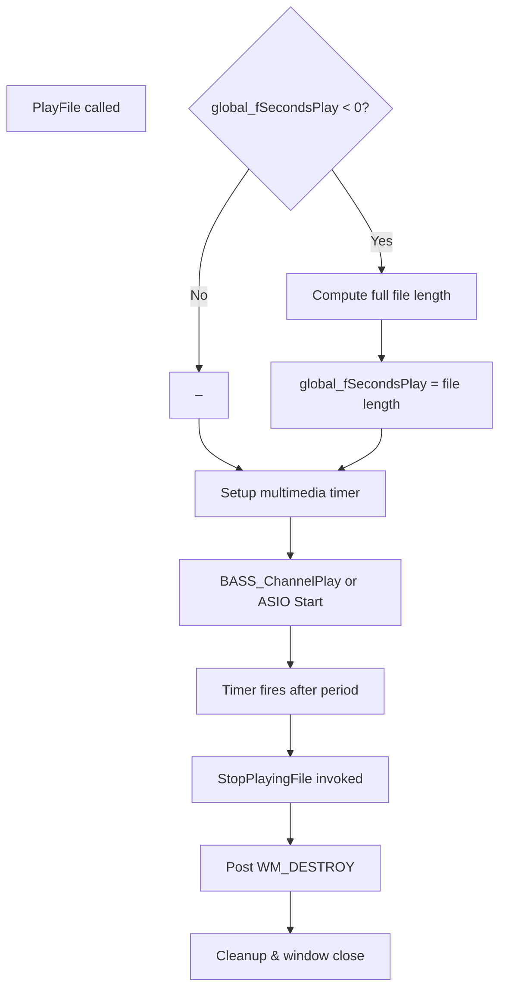

# Audio Playback and File Handling – Playback Duration and Auto-Stop

This section explains how the application governs playback length and automatically stops playback once the specified duration elapses. It covers the global setting for playback duration, the multimedia timer that enforces auto-stop, looping flags for seamless replay, and the special loop mode activated when the Shift key is held at startup.

## 1. global_fSecondsPlay Setting

Every playback session uses the **global_fSecondsPlay** variable to determine how long to play a file.

| Value Range | Behavior |
| --- | --- |
| `< 0.0` (default: `-1.0`) | Play the file once; the window remains open until manually closed. |
| `> 0.0` | Start a multimedia timer to auto-stop playback after `global_fSecondsPlay` seconds. |


- Negative value indicates “play once” mode.
- Positive value triggers **auto-stop** via a timer .

## 2. Multimedia Timer Auto-Stop

When **global_fSecondsPlay** is positive, the app uses `timeSetEvent` to schedule a one-shot timer:

```c
// Schedule auto-stop after global_fSecondsPlay seconds
global_timer = timeSetEvent(
  global_fSecondsPlay * 1000,   // period in ms
  25,                            // resolution
  (LPTIMECALLBACK)&StopPlayingFile,
  0,
  TIME_ONESHOT
);
```

- **timeSetEvent** parameters:
- `delay`: `global_fSecondsPlay * 1000` ms
- `resolution`: 25 ms (timer accuracy)
- `callback`: `StopPlayingFile`
- `flags`: `TIME_ONESHOT` (fire only once) .

### StopPlayingFile Callback

When the timer fires, `StopPlayingFile` posts a `WM_DESTROY` message to the main window, causing cleanup and shutdown of playback:

```c
void CALLBACK StopPlayingFile(
  UINT uTimerID, UINT uMsg,
  DWORD dwUser, DWORD dw1, DWORD dw2
) {
  PostMessage(win, WM_DESTROY, 0, 0);
}
```

- **PostMessage** → triggers `WM_DESTROY` handler to free BASS resources and close the window .

## 3. Looping Flags

To enable seamless looping when playback wraps, the app passes **BASS_SAMPLE_LOOP** (and related) flags when creating streams or music channels:

```c
// Non-ASIO device
chan = BASS_StreamCreateFile(
  FALSE, filename, 0, 0,
  BASS_SAMPLE_LOOP | BASS_SAMPLE_FLOAT | BASS_STREAM_PRESCAN
);

// ASIO device
chan = BASS_StreamCreateFile(
  FALSE, filename, 0, 0,
  BASS_SAMPLE_LOOP | BASS_SAMPLE_FLOAT | BASS_STREAM_DECODE
);
```

- **BASS_SAMPLE_LOOP** ensures the file restarts at end, avoiding silence gaps .
- Combined with decode and prescan flags for optimal stability.

## 4. Loop Mode (Shift-Held at Startup)

Holding the **Shift** key during application launch activates “loop mode.” In this mode:

- **global_bloopmode** is set to `true`.
- **global_fSecondsPlay** is forced to `3600.0` seconds (1 hour), allowing long-running looping before auto-stop.

```c
// During WM_CREATE or WinMain setup
SHORT keyState = GetKeyState(VK_SHIFT);
bool isDown = keyState & 0x8000;
if (isDown) {
  global_bloopmode = true;
  global_fSecondsPlay = 3600.0f;
  if (pFILE) {
    fprintf(pFILE, "Loop mode enabled, %f sec\n", global_fSecondsPlay);
    fflush(pFILE);
  }
}
```

- Users can hold Shift to demo continuous looping without manually specifying duration .

---

### Playback Duration Flow



1. **PlayFile** checks `global_fSecondsPlay`.
2. If negative, calculates full file length and updates the variable.
3. Always schedules a **one-shot** timer.
4. Playback begins immediately.
5. When the timer fires, `StopPlayingFile` shuts down the app.

---

> **Key Takeaways** - **Negative duration** → play once, manual close. - **Positive duration** → auto-stop after set seconds. - **Looping flags** ensure gapless replay. - **Shift-startup** activates extended loop mode for demos.