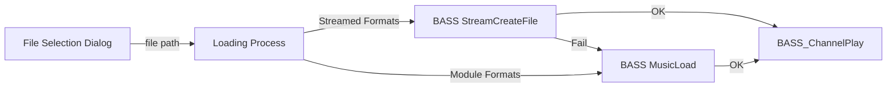

# Audio Playback and File Handling – Supported File Types

This section details how the application loads and plays audio files, outlining the supported formats, the file-open dialog setup, and the underlying BASS library calls. Both the original C example and the extended C++ version leverage **BASS_StreamCreateFile** and **BASS_MusicLoad** to handle a broad spectrum of audio and module/tracker files.

---

## Streamed Audio Formats 🎵

Streamed formats are typical music/audio files decoded on the fly via the **BASS_StreamCreateFile** function.

Supported extensions:

- **.mp3** — MPEG Layer 3 audio
- **.mp2**, **.mp1** — MPEG Layer 2/1 audio
- **.ogg** — Ogg Vorbis
- **.wav** — Waveform Audio File Format
- **.aif**, **.aiff** — Audio Interchange File Format

These formats are loaded with:

```c
chan = BASS_StreamCreateFile(
    FALSE,           // in-memory flag
    filename,        // file path
    0,               // offset
    0,               // length (0 = full file)
    BASS_SAMPLE_LOOP // optional flags (e.g. looping)
);
```

If this call succeeds, the stream is immediately ready for playback .

---

## Module / Tracker Formats 🎛️

Tracker/module formats embed samples and sequencing data. They’re loaded via **BASS_MusicLoad**, which handles events, patterns, and effects:

Supported extensions:

- **.mo3**
- **.xm** — FastTracker II
- **.mod** — ProTracker
- **.s3m** — Scream Tracker 3
- **.it** — Impulse Tracker
- **.mtm** — MultiTracker
- **.umx** — Unreal module

Typical loading code:

```c
chan = BASS_MusicLoad(
    FALSE,                  // in-memory flag
    filename,               // file path
    0,                      // offset
    0,                      // length
    BASS_MUSIC_RAMP    |    // enable volume ramping
    BASS_SAMPLE_LOOP,       // looping
    1                       // use device rate
);
```

This call is attempted if **BASS_StreamCreateFile** fails, ensuring module files still play .

---

## File-Open Dialog Filter

The file-open dialog explicitly lists all supported extensions, guiding users to choose compatible files:

```c
ofn.lpstrFilter =
    "Playable files\0"
    "*.mo3;*.xm;*.mod;*.s3m;*.it;*.mtm;*.umx;"
    "*.mp3;*.mp2;*.mp1;*.ogg;*.wav;*.aif\0"
    "All files\0*.*\0\0";
```

This filter is set on the **OPENFILENAME** structure before calling **GetOpenFileName**, ensuring only supported types appear by default .

---

## Loading Workflow

A fallback strategy tries streamed formats first, then modules:



1. **User** selects a file via the dialog.
2. **BASS_StreamCreateFile** is called.
3. On failure, **BASS_MusicLoad** is invoked.
4. Successful load triggers **BASS_ChannelPlay**.

---

## Extended C++ Flags and Options

In the C++ branch, additional flags enhance precision and prescanning:

```c
if (!(chan = BASS_StreamCreateFile(FALSE, filename, 0, 0,
        BASS_SAMPLE_LOOP |
        BASS_SAMPLE_FLOAT |
        BASS_STREAM_PRESCAN))
 && !(chan = BASS_MusicLoad(FALSE, filename, 0, 0,
        BASS_SAMPLE_LOOP |
        BASS_SAMPLE_FLOAT |
        BASS_MUSIC_RAMPS |
        BASS_MUSIC_PRESCAN, 0))) {
    Error("Can't play file");
    return FALSE;
}
```

- **BASS_SAMPLE_FLOAT**: 32-bit float decoding
- **BASS_STREAM_PRESCAN** / **BASS_MUSIC_PRESCAN**: pre-loads and analyses the file for accurate length calculations
- **BASS_MUSIC_RAMPS**: smooth volume changes

---

```card
{
    "title": "Plugin Support",
    "content": "Additional formats (e.g., FLAC, WMA) can be enabled via BASS plugins, automatically recognized by BASS_StreamCreateFile."
}
```

---

### Summary

- **Streamed formats** (.mp3, .ogg, .wav, etc.) use **BASS_StreamCreateFile**
- **Module formats** (.mod, .xm, .it, etc.) use **BASS_MusicLoad**
- The file-open dialog filter lists each supported extension explicitly
- Extended flags in C++ enable higher fidelity and accurate playback timing

This flexible approach ensures that both common audio files and legacy tracker modules play seamlessly in the spectrum visualizer.