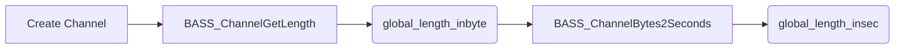

# Audio Playback and File Handling – Volume and Length Information

This section describes how the application manages audio volume and determines track length for playback control, progress display, and click-to-seek interactions. It covers both **initial setup** and **runtime adjustments** using the BASS and BASSASIO libraries.

## Volume Control 🔊

The application maintains a **global volume level** via the `global_fvolume` variable. Volume is:

- **Defaulted** to `1.0` (maximum)
- **Parsed** from the command line (argument 10)
- **Clamped** within the range `[0.0, 1.0]`
- **Applied** to the playback channel at initialization
- **Adjusted** at runtime by user clicks in the spectrum window

### Key Variables and Calls

| Variable | Type | Description | Range |
| --- | --- | --- | --- |
| **global_fvolume** | float | Global playback volume; default 1.0; set via command line | 0.0–1.0 |
| **chan** | DWORD | BASS channel handle returned by `BASS_StreamCreateFile` or `BASS_MusicLoad` | — |
| **BASS_ATTRIB_VOL** | enum | Attribute flag for volume control | — |


#### Initialization

```cpp
// Default value
float global_fvolume = 1.0; 

// Parse from command line (argument #10)
if(argCount > 10) {
    global_fvolume = atof(szArgList[10]);
} 

// Clamp to [0.0, 1.0]
if (global_fvolume < 0.0f) global_fvolume = 0.0f;
if (global_fvolume > 1.0f) global_fvolume = 1.0f;

// Apply to BASS channel
BASS_ChannelSetAttribute(chan, BASS_ATTRIB_VOL, global_fvolume); 
```

#### Runtime Adjustment

When the user **left-clicks** (without holding Shift) in the spectrum window, the Y-coordinate maps linearly to volume:

```cpp
// In WM_LBUTTONUP handler (non-shift click)
float fvolume = 1.0f - ymousepos / (SPECHEIGHT + 0.0f);
BASS_ChannelSetAttribute(chan, BASS_ATTRIB_VOL, fvolume); 

// Update title bar with percentage
int ivol = int(fvolume * 100);
char buf[64];
sprintf(buf, "Volume set to %d%%", ivol);
SetWindowText(h, buf);
```

<card>

{

"title": "Volume Safety",

"content": "Always clamp *global_fvolume* within [0.0, 1.0] before applying it to prevent distortion or errors."

}

</card>

---

## Track Length Retrieval ⏱️

To support progress display and click-to-seek logic, the app queries the audio stream for its total length in **bytes** and **seconds** at initialization.

### Steps for Length Query

1. **Get total length in bytes** using `BASS_ChannelGetLength(chan, BASS_POS_BYTE)`.
2. **Convert bytes to seconds** via `BASS_ChannelBytes2Seconds(chan, lengthInBytes)`.
3. **Store** results in `global_length_inbyte` and `global_length_insec`.

```cpp
// After channel is created and before playback:
global_length_inbyte = BASS_ChannelGetLength(chan, BASS_POS_BYTE);
global_length_insec = BASS_ChannelBytes2Seconds(chan, global_length_inbyte); 
```

| Variable | Type | Description |
| --- | --- | --- |
| **global_length_inbyte** | QWORD | Total track length in bytes |
| **global_length_insec** | double | Total track length in seconds |




---

## Seeking and Progress Display ▶️

Users can **seek** to a new position by **Shift + click** in the spectrum window. The logic utilizes the stored byte length to calculate an absolute byte offset, sets the playback position, and formats the new time.

```cpp
// In WM_LBUTTONUP handler (shift-click)
QWORD offset_inbyte = QWORD(global_length_inbyte * (xmousepos / float(SPECWIDTH)));
BASS_ChannelSetPosition(chan, offset_inbyte, BASS_POS_BYTE); 

double offset_insec = BASS_ChannelBytes2Seconds(chan, offset_inbyte);
int h = int(offset_insec / 3600);
int m = int(offset_insec / 60) - h * 60;
int s = int(offset_insec) - h * 3600 - m * 60;

char buf[64];
sprintf(buf, "Position set to %02dh:%02dm:%02ds", h, m, s);
SetWindowText(hWnd, buf);
```

- **Byte-based positioning** ensures precise seeking in compressed or streamed formats.
- **Time display** provides user feedback in `hh:mm:ss` format.

---

By combining **command-line configuration**, **BASS attribute APIs**, and **interactive mouse events**, this section empowers users with flexible volume control and accurate track navigation.