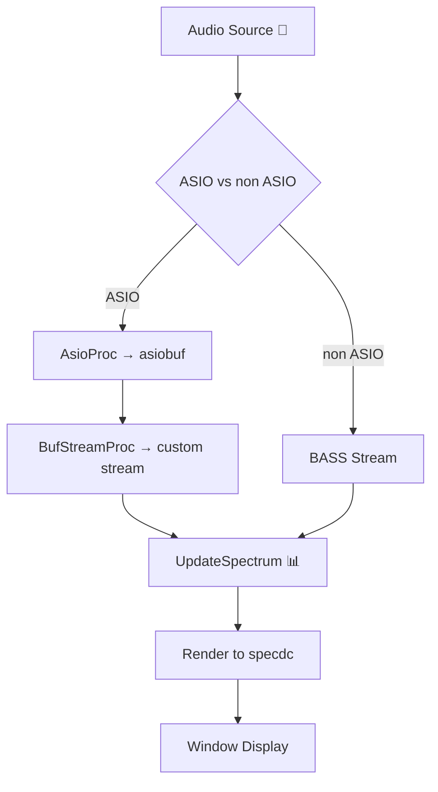

# Project Files and Layout

This section details the primary **source files** in the spispectrumplay project. These two files form the core of the application: a modern C++ Win32 GUI with ASIO support, and the original C example baseline.

## Source Files

The project includes:

- **spispectrumplay.cpp**: C++ main application with ASIO and non-ASIO support.
- **spispectrumplay.c**: Original Un4seen Developments C example, non-ASIO only.

### spispectrumplay.cpp ⚙️

This C++ file implements the full-featured spectrum player and visualizer. It handles command-line parsing, device enumeration, ASIO setup, playback logic, drawing, mouse interactions, and advanced options like transparency and loop mode .

| Component | Responsibilities |
| --- | --- |
| Command-Line Parsing | Uses `CommandLineToArgvA` to parse filename, play duration, position, mode, device name, alpha, and volume. |
| Device Enumeration | Builds `global_asiodevicemap` and `global_nonasiodevicemap`; selects default or user-specified device. |
| ASIO vs Non-ASIO Setup | Initializes BASS or BASS_ASIO; in ASIO mode, sets up `AsioProc` and `BufStreamProc` buffering. |
| Playback Logic | Implements `PlayFile` to load streams (`BASS_StreamCreateFile` / `BASS_MusicLoad`) with looping or decode. |
| Visualization Drawing | Schedules `UpdateSpectrum` timer to fetch FFT or waveform data and render to an off-screen DIB. |
| Window Procedure | `SpectrumWindowProc` handles `WM_CREATE`, `WM_TIMER`, `WM_LBUTTONUP`, `WM_DESTROY` for UI and mouse events. |
| Mouse Tracking & Controls | Tracks hover/leave for tooltips, click/shift-click for volume, seek, mode change; updates title bar. |
| Advanced Configuration | Exposes `global_alpha`, `global_fvolume`, `global_bloopmode`; adjusts transparency, volume, and loop mode. |


```cpp
// ASIO callback: copy incoming audio into circular buffer
DWORD CALLBACK AsioProc(BOOL input, DWORD channel, void *buffer, DWORD length, void *user) {
    DWORD c = BASS_ChannelGetData((DWORD)user, buffer, length);
    if (c < asiobuflen) {
        memmove(asiobuf, asiobuf + c, asiobuflen - c);
        memcpy(asiobuf + asiobuflen - c, buffer, c);
    } else {
        memcpy(asiobuf, buffer, asiobuflen);
    }
    return c;
}
```

*Excerpt from spispectrumplay.cpp*

### spispectrumplay.c 🎵

This classic C example demonstrates a simple BASS spectrum analyzer without ASIO. It provides a file-open dialog, looping playback, and four visualization modes (three FFT styles + waveform) as a **reference baseline** .

- **File Selection**: Opens standard Windows `GetOpenFileName` dialog to pick an audio file.
- **Playback**: Uses `BASS_StreamCreateFile` or `BASS_MusicLoad` with `BASS_SAMPLE_LOOP`, then `BASS_ChannelPlay`.
- **Spectrum Modes**:
- Mode 0: “Normal” FFT bars
- Mode 1: Logarithmic bands averaging bins
- Mode 2: “3D” scrolling spectrum
- Mode 3: Waveform view
- **Rendering**:
- `UpdateSpectrum` callback samples data (`BASS_ChannelGetData`), fills `specbuf`, then `BitBlt` to window.
- **Error Handling**: Displays `MessageBox` with `BASS_ErrorGetCode()` on failures.

```c
// Update display: FFT or waveform
void CALLBACK UpdateSpectrum(...) {
    float fft[1024];
    BASS_ChannelGetData(chan, fft, BASS_DATA_FFT2048);
    // draw bars into specbuf[]
    BitBlt(dc, 0, 0, SPECWIDTH, SPECHEIGHT, specdc, 0, 0, SRCCOPY);
}
```

*Excerpt from spispectrumplay.c*

### Shared Concepts 📊

Both versions implement the core **spectrum drawing pipeline**:

- `**UpdateSpectrum**`: Timer callback that fetches audio data, processes FFT or waveform, and updates an off-screen bitmap.
- `**SpectrumWindowProc**`** / **`**WinProc**`: Window procedure handling creation, timer events, mouse clicks, and cleanup.
- **Palette & DIB**: Create a DIB section (`CreateDIBSection`) for pixel-perfect rendering of spectral data.

The C++ version enhances this foundation with:

- **Device Selection** by name or default
- **ASIO Buffering** to prevent data loss
- **Interactive Controls**: seamless mode switching, seek, volume adjustment
- **Transparency** via `global_alpha` Windows layering

---



This diagram illustrates the audio data flow from source through buffering and visualization, common to both implementations.

---

**Next Steps**

- Review **resource.h** and **spispectrumplay_asio.rc** for UI assets.
- Explore **makefile** and project files for build configurations.