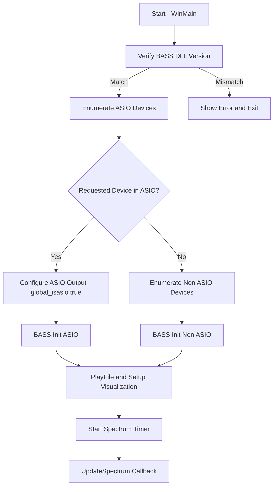

# Running the Application – Runtime Behavior

Once launched, the application follows a deterministic sequence to verify dependencies, select the audio device, initialize playback, and render the spectrum. This section explains each step in detail, illustrating how the app adapts to ASIO and non-ASIO environments.

---

## 1. Verify BASS Library Version

Before any audio operations, the application ensures the loaded BASS DLL matches the expected version.

- Calls `BASS_GetVersion` and compares the high word to `BASSVERSION`.
- On mismatch, it displays an error dialog and exits.

```c
// In WinMain
if (HIWORD(BASS_GetVersion()) != BASSVERSION) {
    MessageBox(0,
        "An incorrect version of BASS.DLL was loaded",
        0, MB_ICONERROR);
    return 0;
}
```

This check prevents runtime failures due to API changes .

---

## 2. Enumerate and Select ASIO Devices 🎛️

The app builds a map of all installed ASIO devices for optional selection:

- Iterates `BASS_ASIO_GetDeviceInfo(i, &info)` until it returns false.
- Inserts each device name and its index into `global_asiodevicemap`.

```c
for (int i = 0; BASS_ASIO_GetDeviceInfo(i, &info); i++) {
    global_asiodevicemap.insert({ info.name, i });
}
```

It then checks if the user-specified `global_audiodevicename` exists in the map.

- **Match found**: sets `global_deviceid` and `global_isasio = true`.
- **No match**: falls back to non-ASIO enumeration.

This mechanism lets users target professional ASIO drivers when available .

---

## 3. Enumerate and Select Non-ASIO Devices

If ASIO mode is not active, the app enumerates all enabled WDM/MME devices:

- Calls `BASS_GetDeviceInfo(i, &info)` in a loop.
- Records devices with the `BASS_DEVICE_ENABLED` flag into `global_nonasiodevicemap`.
- Tracks the default device via the `BASS_DEVICE_DEFAULT` flag.

```c
for (int i = 0; BASS_GetDeviceInfo(i, &info); i++) {
    if (info.flags & BASS_DEVICE_ENABLED) {
        global_nonasiodevicemap.insert({ info.name, i });
        if (info.flags & BASS_DEVICE_DEFAULT) {
            global_deviceid = i;  // default device
        }
    }
}
```

Selection logic:

- If `global_audiodevicename` matches an enabled device, use it.
- Else use the default device.
- As a last resort, set `global_deviceid = 1` (first real device).

This ensures playback even on systems without ASIO support  .

---

## 4. Initialize BASS with the Chosen Device

Depending on `global_isasio`, the app calls `BASS_Init` with different parameters:

| Mode | Call |
| --- | --- |
| ASIO | `BASS_Init(-1, freq, 0, win, NULL)` |
| non-ASIO | `BASS_Init(global_deviceid, freq, 0, win, NULL)` |


```c
if (global_isasio) {
    BASS_Init(-1, 44100, 0, win, NULL);
} else {
    BASS_Init(global_deviceid, 44100, 0, win, NULL);
}
```

This configures the BASS output to the selected device .

---

## 5. Start Playback & Setup Visualization 🎵

After initialization, the app invokes `PlayFile`, which:

1. Loads the audio (stream or module) via `BASS_StreamCreateFile` or `BASS_MusicLoad`.
2. For ASIO mode:
3. Initializes ASIO with `BASS_ASIO_Init`.
4. Enables output channels via `BASS_ASIO_ChannelEnable`/`Join`.
5. Sets format and rate (`BASS_ASIO_ChannelSetFormat`, `BASS_ASIO_SetRate`).
6. Starts ASIO processing (`BASS_ASIO_Start`).
7. Calls `BASS_ChannelPlay` for non-ASIO mode.

```c
// ASIO setup snippet
if (!BASS_ASIO_Init(global_deviceid, BASS_ASIO_THREAD))
    Error("Can't initialize ASIO device");
BASS_ASIO_ChannelEnable(0, sel[0], &AsioProc, (void*)chan);
BASS_ASIO_ChannelSetFormat(0, sel[0], BASS_ASIO_FORMAT_FLOAT);
BASS_ASIO_Start(0);
```

Once playback begins, the main window creates an 8-bit DIB section for drawing the spectrum and starts a periodic timer  .

---

## 6. Spectrum Update Timer & Rendering

A multimedia timer fires every 25 ms to invoke `UpdateSpectrum`:

- Retrieves either waveform or FFT data:
- **non-ASIO**: `BASS_ChannelGetData(chan, buf, flags)`
- **ASIO**: `BASS_ChannelGetData(bufstream, buf, flags)`
- Depending on `specmode`, it plots waveform, linear FFT, logarithmic bands, or “3D” mode.
- Updates the window by blitting the DIB to the client DC.

```c
void CALLBACK UpdateSpectrum(...){
    if (global_isasio)
        BASS_ChannelGetData(bufstream, fft, BASS_DATA_FFT2048);
    else
        BASS_ChannelGetData(chan,     fft, BASS_DATA_FFT2048);
    // ... draw into specbuf and BitBlt ...
}
```

This callback drives the real-time visualization of audio data .

---

## Process Flowchart



This diagram summarizes the application’s runtime behavior and decision points.