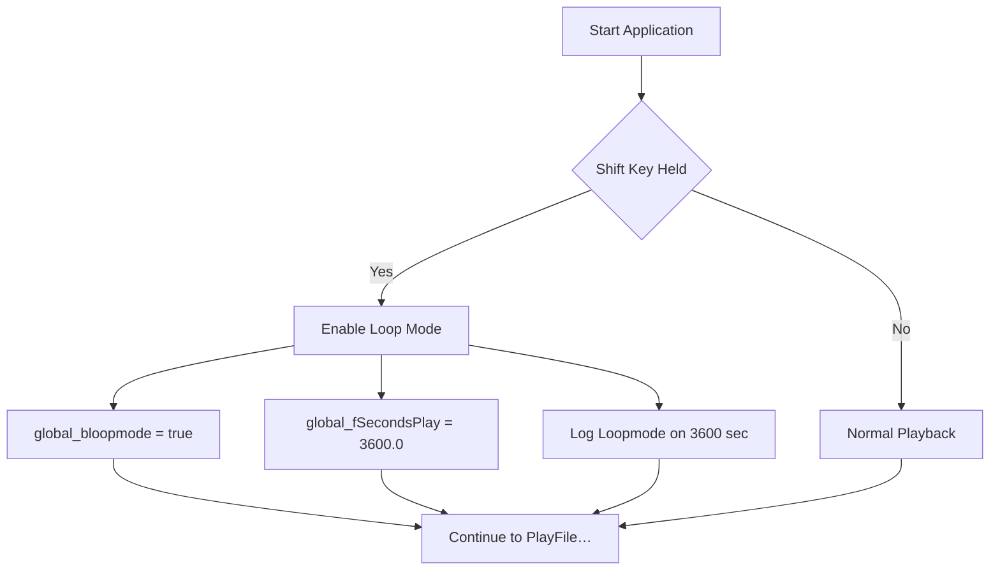

# Running the Application – Shift-Key Loop Mode

This section explains how the application detects a Shift-Key press at startup to enable an extended “loop mode.” When activated, the program will continuously loop the audio for a long duration (1 hour) before shutting down, instead of playing once then exiting immediately.

---

## 📌 Purpose

- **Enable extended looping** of the currently loaded audio file when the user holds Shift at launch.
- **Prevent immediate window shutdown** by scheduling a delayed stop callback.
- Provide a **diagnostic log entry** confirming loop mode activation.

---

## How It Works

1. At **application startup** (in WinMain), before creating the window, the program checks the Shift key state.
2. In the **WM_CREATE** handler of the main window, it re-checks Shift in case the key state changed between process start and window creation.
3. If Shift is held down, it sets two global flags and writes a log line.
4. Later, when the file playback is initialized, `global_fSecondsPlay` drives a timer that calls `StopPlayingFile` after the specified duration, keeping the BASS loop flags active until then.



---

## Key Variables

| Variable | Type | Default | Description |
| --- | --- | --- | --- |
| **global_bloopmode** | bool | false | When `true`, indicates loop mode was activated. |
| **global_fSecondsPlay** | float | –1.0 | Duration (seconds) before forcing playback stop. |


Both are declared in the globals section:

```cpp
bool global_bloopmode = false;  
float global_fSecondsPlay;           // negative → play once by default  
```

---

## 1. Startup Detection 🌟

In `WinMain`, after parsing optional command-line arguments but **before** window creation, the code checks the Shift key:

```cpp
// 2022may14, spi, begin
SHORT keyState = GetKeyState(VK_SHIFT);
bool isDown   = keyState & 0x8000;
if (isDown) {
    global_bloopmode    = true;
    global_fSecondsPlay = 3600.0;
    if (pFILE) {
        fprintf(pFILE, "Loopmode, on, %f sec\n", global_fSecondsPlay);
        fflush(pFILE);
    }
}
// 2022may14, spi, end
```

- `GetKeyState(VK_SHIFT)` returns a 16-bit value; the high bit (`0x8000`) indicates if the key is currently down.
- If **Shift** is down, **loop mode** is enabled and playback duration is set to 3600 seconds (1 hour).
- A diagnostic log line (`"Loopmode, on, 3600.000000 sec"`) is written if logging is active.

---

## 2. Window Creation Hook 🛎️

Inside the window procedure (`SpectrumWindowProc`), the **WM_CREATE** message repeats the Shift check to catch any late-held press:

```cpp
case WM_CREATE: {
    // 2022may14, spi, begin
    SHORT keyState = GetKeyState(VK_SHIFT);
    bool isDown   = keyState & 0x8000;
    if (isDown) {
        global_bloopmode    = true;
        global_fSecondsPlay = 3600.0;
        if (pFILE) {
            fprintf(pFILE, "Loopmode, on, %f sec\n", global_fSecondsPlay);
            fflush(pFILE);
        }
    }
    // 2022may14, spi, end

    // …continue BASS initialization…
    break;
}
```

- Ensures **consistent behavior** whether Shift was held at process launch or struck just before window creation.
- Avoids missing the user’s intent if there’s a slight delay between `WinMain` and window creation.

---

## 3. Scheduling the Stop Callback ⏲️

Once playback is prepared in `PlayFile`, the code uses `global_fSecondsPlay` to schedule a one-shot timer. After that duration, `StopPlayingFile` posts `WM_DESTROY`, closing the window:

```cpp
if (global_fSecondsPlay <= 0) {
    // If no loop mode, play the file once:
    QWORD length_byte = BASS_ChannelGetLength(chan, BASS_POS_BYTE);
    global_fSecondsPlay = BASS_ChannelBytes2Seconds(chan, length_byte);
}
// Schedule window destruction after global_fSecondsPlay seconds
global_timer = timeSetEvent(
    global_fSecondsPlay * 1000,  // milliseconds
    25,                          // resolution
    (LPTIMECALLBACK)&StopPlayingFile,
    0, 
    TIME_ONESHOT
);
```

- **Without** loop mode: `global_fSecondsPlay` is negative, so it is set to the file’s actual length → plays **once**.
- **With** loop mode: already set to 3600 → timer fires in one hour, during which BASS’s loop flags keep the audio looping.
- `StopPlayingFile` simply posts `WM_DESTROY`, causing cleanup and exit.

---

## Impact on Broader Architecture

- **Global flags** drive both **audio flags** (BASS_SAMPLE_LOOP) and the **shutdown timer**.
- Ensures tight coupling between **user intent** (Shift-Key) and **playback lifecycle**.
- Minimal additional dependencies; leverages Win32’s keyboard state API and multimedia timer.

---

**Key Takeaways**

- Holding **Shift** at startup activates a 1 hour loop mode.
- Two identical checks (in `WinMain` and `WM_CREATE`) guarantee reliable detection.
- A timed callback uses `global_fSecondsPlay` to terminate the loop gracefully after the desired period.