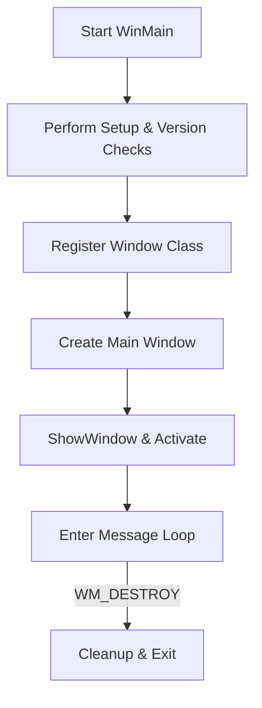

# User Interface and Window Management

This section covers the creation of the main visualization window in the Win32 GUI application. It explains how the entry point (`WinMain`) registers a custom window class and creates the main spectrum player window, detailing the class attributes, window styles, sizing logic, and the message loop that drives the UI.

---

## Main Window Creation

The `WinMain` function serves as the application’s entry point. It performs initial setup—such as logging, device mapping, and argument parsing—then registers a window class and creates the main window to display the audio spectrum visualization.

```cpp
int PASCAL WinMain(HINSTANCE hInstance,
                   HINSTANCE hPrevInstance,
                   LPSTR    lpCmdLine,
                   int      nCmdShow)
{
    // ... (initial setup, device/version checks)

    // Register window class and create the window ↓
    WNDCLASS wc = { 0 };
    MSG      msg;

    wc.lpfnWndProc   = SpectrumWindowProc;
    wc.hInstance     = hInstance;
    wc.hCursor       = LoadCursor(NULL, IDC_ARROW);
    wc.hIcon         = LoadIcon(hInstance, MAKEINTRESOURCE(IDI_ICON1));  // Resource-defined icon
    wc.lpszClassName = "spispectrumplay";

    if (!RegisterClass(&wc)
     || !CreateWindow("spispectrumplay",
                      global_windowtitle.c_str(),
                      WS_POPUPWINDOW | WS_CAPTION | WS_VISIBLE,
                      global_x, global_y,
                      SPECWIDTH + 2 * GetSystemMetrics(SM_CXDLGFRAME),
                      SPECHEIGHT + GetSystemMetrics(SM_CYCAPTION) + 2 * GetSystemMetrics(SM_CYDLGFRAME),
                      NULL, NULL, hInstance, NULL))
    {
        Error("Can't create window");
        return 0;
    }

    ShowWindow(win, SW_SHOWNORMAL);
    while (GetMessage(&msg, NULL, 0, 0) > 0) {
        TranslateMessage(&msg);
        DispatchMessage(&msg);
    }
    return 0;
}
```

<small>Excerpted from the WinMain implementation in *spispectrumplay.cpp* </small>

---

## 1. Window Class Definition

Before creating any window, `WinMain` defines a `WNDCLASS` structure to specify how the window behaves and appears.

| Property | Description | Value / Callback |
| --- | --- | --- |
| **lpfnWndProc** | Message handler for all window events | `SpectrumWindowProc` |
| **hInstance** | Handle to the current application instance | `hInstance` (from WinMain) |
| **hCursor** | Mouse cursor when hovering over the window | `LoadCursor(NULL, IDC_ARROW)` |
| **hIcon** | Window icon displayed in the title bar and taskbar | `LoadIcon(hInstance, MAKEINTRESOURCE(IDI_ICON1))` |
| **lpszClassName** | Unique class identifier used in `CreateWindow` calls | `"spispectrumplay"` |


✨ 

---

## 2. Window Styles & Title

When invoking `CreateWindow`, several parameters control the window’s look and behavior:

- **Styles**
- `WS_POPUPWINDOW` : Creates a pop-up window with a border.
- `WS_CAPTION`     : Includes a title bar (implies `WS_BORDER`).
- `WS_VISIBLE`     : Makes the window visible upon creation.

- **Title Text**

The window title is provided by the global string:

```cpp
  string global_windowtitle = 
    "spispectrumplay - click sets vol, shift-click changes mode or pos)";
```

This instructional text appears in the title bar until the user interacts with the UI .

---

## 3. Position & Size Calculation

To ensure the visualization area aligns perfectly with the client region, the window’s position and dimensions are computed dynamically:

| Parameter | Source / Macro | Default Value |
| --- | --- | --- |
| **X Position** | `global_x` | `200` |
| **Y Position** | `global_y` | `200` |
| **Client Width** | `SPECWIDTH` | `400` pixels |
| **Client Height** | `SPECHEIGHT` | `127` pixels |
| **Frame Padding** | `2 * GetSystemMetrics(SM_CXDLGFRAME)` | System default frame width |
| **Caption Height** | `GetSystemMetrics(SM_CYCAPTION)` | System default caption height |
| **Vertical Frame** | `2 * GetSystemMetrics(SM_CYDLGFRAME)` | System default frame height |


**Computed Window Dimensions**

```text
width  = SPECWIDTH + 2 * SM_CXDLGFRAME
height = SPECHEIGHT + SM_CYCAPTION + 2 * SM_CYDLGFRAME
```

These calculations guarantee the drawing area exactly matches the spectrum buffer dimensions, avoiding scrollbars or clipping.

---

## 4. Display & Message Loop

After creation, `ShowWindow` makes the window visible, and the standard Win32 message loop takes over:

```cpp
ShowWindow(win, SW_SHOWNORMAL);
while (GetMessage(&msg, NULL, 0, 0) > 0) {
    TranslateMessage(&msg);
    DispatchMessage(&msg);
}
```

- **TranslateMessage**: Converts keyboard messages into character messages.
- **DispatchMessage**: Delivers events (mouse, paint, destroy) to `SpectrumWindowProc`.

This loop runs until a `WM_DESTROY` message posts `PostQuitMessage`, signaling application termination.

---

## 5. Creation Flowchart



This flow highlights the sequential steps from application startup to shutdown, emphasizing the central role of window registration and creation in the UI lifecycle.

---

<small>All code excerpts and constants are sourced from *spispectrumplay.cpp* and related headers in the `oifii/spispectrumplay_asio-non-asio_vs2026` repository.</small>