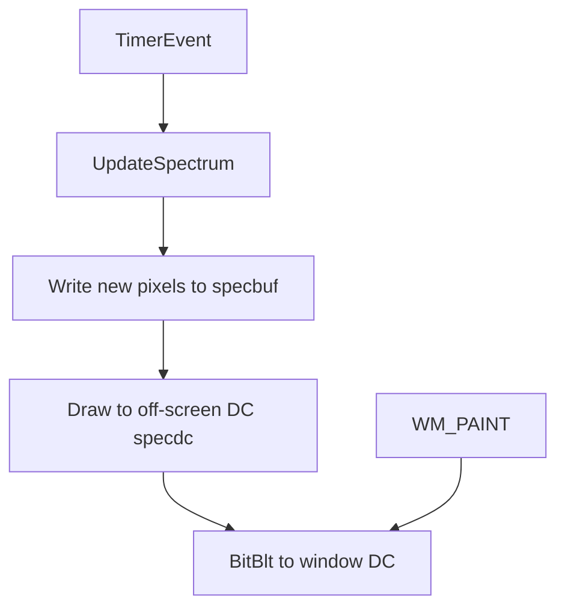

# User Interface and Window Management – Painting and Redraw

This section explains how the spectrum visualizer handles painting and redrawing efficiently. The core idea is to render the audio-spectrum into an off-screen bitmap (`specdc`), then blit that bitmap onto the window when needed.

## Off-Screen Buffer Setup

An off-screen device context and bitmap are created once during window creation to hold the spectrum image.

- **Create DIB Section** for pixel buffer (`specbuf`)
- **Create Compatible DC** (`specdc`) and select the bitmap into it
- **Palette** setup ensures 8-bit colors map to meaningful spectrum shades

```cpp
// in WM_CREATE:
BITMAPINFOHEADER bh = { sizeof(bh), SPECWIDTH, SPECHEIGHT, 1, 8, 0 };
RGBQUAD pal[256];
// … initialize palette entries …
specbmp = CreateDIBSection(0, (BITMAPINFO*)&bh, DIB_RGB_COLORS, (void**)&specbuf, NULL, 0);
specdc  = CreateCompatibleDC(0);
SelectObject(specdc, specbmp);
```

*This off-screen buffer lets the app draw pixels rapidly without flicker.*

## WM_PAINT Handling

Whenever Windows requests a repaint, the app simply copies the current off-screen bitmap to the window DC.

- **BeginPaint/EndPaint** to validate the update region
- **BitBlt** from `specdc` to the window DC

```cpp
case WM_PAINT:
    if (GetUpdateRect(h,0,0)) {
        PAINTSTRUCT ps;
        HDC dc = BeginPaint(h, &ps);
        BitBlt(dc, 0, 0, SPECWIDTH, SPECHEIGHT, specdc, 0, 0, SRCCOPY);
        EndPaint(h, &ps);
    }
    return 0;
```

*This minimal work in the message loop keeps UI responsive.*

## Timer-Driven Updates

A multimedia timer fires at a fixed rate (≈40 Hz) to update the spectrum data and redraw without polling in the main loop.

1. **Start timer** after playback begins
2. **Callback **`**UpdateSpectrum**` writes new pixel data into `specbuf`
3. **Blit** the updated bitmap to the window via `BitBlt`

```cpp
// in WM_CREATE:
timer = timeSetEvent(25, 25, (LPTIMECALLBACK)&UpdateSpectrum, 0, TIME_PERIODIC);

// Callback function:
void CALLBACK UpdateSpectrum(...){
    // … compute new specbuf pixels …
    HDC dc = GetDC(win);
    BitBlt(dc, 0, 0, SPECWIDTH, SPECHEIGHT, specdc, 0, 0, SRCCOPY);
    ReleaseDC(win, dc);
}
```

*Decoupling data update from WM_PAINT ensures smooth animation.*

## Drawing Workflow Diagram



*This flow shows how data and painting interact without blocking the UI.*

## Painting and Redraw Comparison

| Trigger | Purpose | Mechanism |
| --- | --- | --- |
| **WM_PAINT** 🎨 | Copy current spectrum image to window | `BeginPaint` → `BitBlt(specdc→window DC)` → `EndPaint` |
| **Timer** ⏱️ | Recompute spectrum and redraw continuously | `UpdateSpectrum` writes `specbuf` → `BitBlt` |


## Performance Considerations

- **Off-screen DIB** avoids per-pixel GDI calls on the window DC.
- **BitBlt** is hardware-accelerated in many environments.
- **Lightweight WM_PAINT** work avoids UI stutter under heavy audio processing.

> **Tip**: Adjust the timer period to balance CPU usage and visual smoothness.

---

With this design, the visualizer remains responsive, flicker-free, and efficient even under continuous real-time updates.