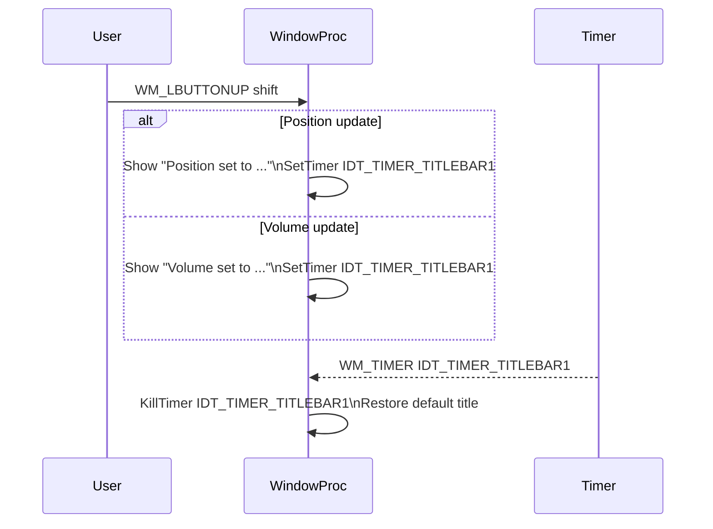

# User Interface and Window Management

## Title Bar Notifications 🔔

The title bar serves as a dynamic feedback area. It displays the application’s default title, the currently playing filename (truncated to fit), and temporary notifications (e.g., volume or playback-position changes). Internally, it relies on global variables, mouse and timer events, and careful string handling to avoid buffer overruns.

---

### Key Variables and Helpers

Below is an overview of the core variables and functions used for title bar management.

| Variable / Macro | Type | Purpose | Initial Value / Definition |
| --- | --- | --- | --- |
| **global_windowtitle** | `string` | Default title displayed when idle | `"spispectrumplay - click sets vol, shift-click changes mode or pos)"` |
| **global_filename_tobedisplayed** | `string` | Tail of the loaded filename, sized to fit the title bar buffer | `""` (set in `WM_CREATE`) fileciteturn0file1 |
| **global_windowtitle_notificationtime_ms** | `int` | Duration (ms) for temporary notifications | `2000` |
| **IDT_TIMER_TITLEBAR1** | `UINT` (macro) | Identifier for title-bar notification timer | Defined as `IDT_TIMER_TITLEBAR1` |
| **tail()** | `std::string(src,len)` | Returns the last `len` characters of `src` |  |


```cpp
std::string tail(std::string const& source, size_t length) {
  if (length >= source.size()) return source;
  return source.substr(source.size() - length);
}
```

---

### Initializing the Displayable Filename

When the audio file is opened (in the `WM_CREATE` handler), the code computes how many characters can fit in the title bar and extracts the filename’s tail.

```cpp
case WM_CREATE:
    win = h;
    // ...
    // Determine maximum characters to display
    nmaxchartobedisplayed = min(global_filename.size(), global_windowtitle.size());
    // Extract the tail of the filename
    global_filename_tobedisplayed = tail(global_filename, nmaxchartobedisplayed);
    // ...
    break;
```

This ensures the filename snippet never exceeds the title buffer length, preventing overflows.

---

### Hover and Focus Behavior

The application toggles between the default title and the truncated filename based on mouse events. This helps users identify the loaded file without permanently altering the UI.

```cpp
case WM_MOUSEMOVE:
    // Show full default title when the cursor enters the client area
    if (titlebartext.find(global_windowtitle) == std::string::npos) {
        SetWindowText(h, global_windowtitle.c_str());
    }
    return 0;

case WM_MOUSELEAVE:
case WM_MOUSEHOVER:
case WM_NCMOUSEMOVE:
    // Show the truncated filename when the cursor leaves or hovers
    if (titlebartext.find(global_filename_tobedisplayed) == std::string::npos) {
        SetWindowText(h, global_filename_tobedisplayed.c_str());
    }
    mouseTrack.Reset(h);
    return 0;
```

- **WM_MOUSEMOVE** ensures the default title is restored on entry.
- **WM_MOUSELEAVE**, **WM_MOUSEHOVER**, and **WM_NCMOUSEMOVE** switch to the filename tail.

---

### Temporary Notifications

Volume changes, playback-position updates, and mode switches trigger temporary messages in the title bar. A timer resets the title back to the default after a fixed interval.

1. **User Action (Click)**
2. **Shift+Click** near the x-axis sets playback position and displays

`"Position set to XXh:YYm:ZZs"`.

- **Click** elsewhere adjusts volume and displays

`"Volume set to N%"`.

Both paths start the notification timer.

```cpp
case WM_LBUTTONUP:
    if (w == MK_SHIFT) {
        // Position update
        SetTimer(h, IDT_TIMER_TITLEBAR1, global_windowtitle_notificationtime_ms, NULL);
        SetWindowText(h, trackposition.c_str());  // e.g., "Position set to 00h:01m:23s"
    } else {
        // Volume update
        SetTimer(h, IDT_TIMER_TITLEBAR1, global_windowtitle_notificationtime_ms, NULL);
        SetWindowText(h, charbuf);  // e.g., "Volume set to 75%"
    }
    return 0;
```

1. **Timer Elapses (Reset)**

The `WM_TIMER` event kills the timer and restores the default title.

```cpp
case WM_TIMER:
    if (w == IDT_TIMER_TITLEBAR1) {
        KillTimer(h, IDT_TIMER_TITLEBAR1);
        SetWindowText(h, global_windowtitle.c_str());
    }
    return 0;
```

---

### Sequence Diagram: Notification Flow



---

### Best Practices & Notes 📌

- **Buffer Safety**: Always compute `nmaxchartobedisplayed` before slicing strings.
- **User Feedback**: Temporary notifications last `global_windowtitle_notificationtime_ms` ms (2 s).
- **Clean Reset**: Killing the timer prevents orphaned timers and unintended behavior.
- **Consistent UX**: Hover logic unifies title toggling for clarity.

This design balances informative feedback with UI stability, ensuring users always know the current file, volume, and position without overwhelming the title bar.