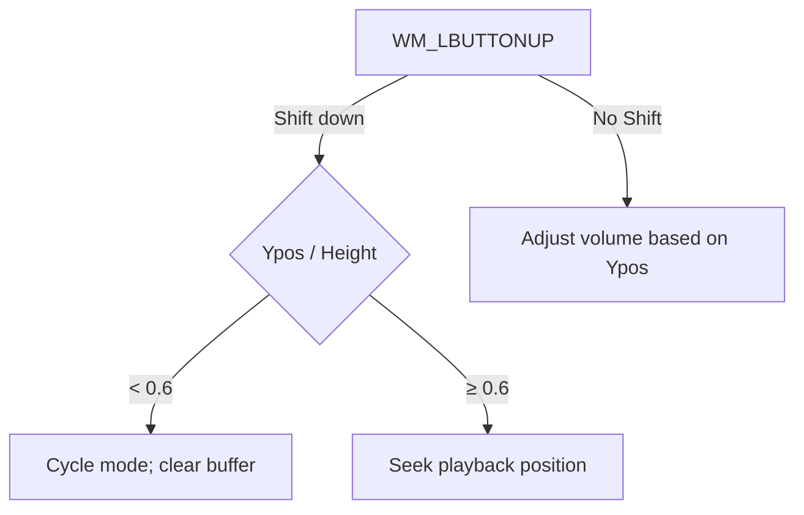

# Using the Visualizer – Mouse Interaction in the Window

This section describes how the main spectrum window procedure (`SpectrumWindowProc`) handles mouse input, enabling you to switch visualization modes, adjust volume, seek playback position, and display contextual hints. All interactions occur in response to Windows messages (e.g. `WM_LBUTTONUP`, `WM_MOUSEMOVE`) within the spectrum window.

## Mouse Events Overview

Below is a summary of the key messages and their associated behaviors:

| Message | Purpose | Action |
| --- | --- | --- |
| **WM_LBUTTONUP** | Left‐button release | Change mode, volume, or playback position depending on modifiers |
| **WM_MOUSEMOVE** | Pointer moves inside client area | Start hover tracking; reset title to default |
| **WM_MOUSEHOVER** | Pointer hovers without moving | Show filename in title |
| **WM_MOUSELEAVE** | Pointer leaves client area | Revert title to filename |
| **WM_NCMOUSEMOVE** | Pointer moves over non-client area (title bar, frame) | Revert title to filename |
| **WM_TIMER** | Title‐bar notification timeout | Restore default title after temporary messages |


## 🎨 Left-Click Release (`WM_LBUTTONUP`)

When the user releases the left mouse button, the application branches based on whether the **Shift** key is held:

```c
case WM_LBUTTONUP:
    if (w == MK_SHIFT) {
        // Mode cycling or seeking (shift-click)
        float fthreshold = (float)ymousepos / (SPECHEIGHT);
        if (fthreshold < 0.60f) {
            // Cycle visualization mode
            specmode = (specmode + 1) % 4;
            memset(specbuf, 0, SPECWIDTH * SPECHEIGHT);
        } else {
            // Seek playback position
            QWORD offset_inbyte = global_length_inbyte
                * ((float)xmousepos / SPECWIDTH);
            BASS_ChannelSetPosition(chan, offset_inbyte, BASS_POS_BYTE);
            // Temporarily display new position in title
            KillTimer(h, IDT_TIMER_TITLEBAR);
            SetTimer(h, IDT_TIMER_TITLEBAR,
                     global_windowtitle_notificationtime_ms, NULL);
            /* …format and SetWindowText(h, trackposition)… */
        }
    } else {
        // Volume adjustment (click sets vol)
        fvolume = 1.0f - (float)ymousepos / (SPECHEIGHT);
        BASS_ChannelSetAttribute(chan, BASS_ATTRIB_VOL, fvolume);
        // Temporarily display new volume in title
        KillTimer(h, IDT_TIMER_TITLEBAR);
        SetTimer(h, IDT_TIMER_TITLEBAR,
                 global_windowtitle_notificationtime_ms, NULL);
        /* …format and SetWindowText(h, "Volume set to XX%")… */
    }
    return 0;
```

This logic is implemented in the `SpectrumWindowProc` switch‐case for `WM_LBUTTONUP` .

### ⏩ Shift-Click: Mode Cycling vs. Seeking

- **Above horizontal threshold**

If `ymousepos / SPECHEIGHT < 0.60`, the visualizer **cycles** to the next mode (`specmode = (specmode + 1) % 4`) and **clears** the spectrum buffer.

- **Below horizontal threshold**

The click is interpreted as a **seek** command. Playback jumps to `global_length_inbyte * (xmousepos / SPECWIDTH)` bytes, and the new time is shown temporarily in the title bar.

### 🎵 Click (No Shift): Volume Adjustment

A simple left‐click maps the vertical position to volume:

- `fvolume = 1.0 – (ymousepos / SPECHEIGHT)`
- `BASS_ChannelSetAttribute(chan, BASS_ATTRIB_VOL, fvolume)`

The title bar briefly displays the new volume percentage before reverting .

#### Click Handling Flowchart



## Title Bar Hints and Notifications

The application uses the window’s title bar to guide and inform the user:

- **Default title**

`"spispectrumplay - click sets vol, shift-click changes mode or pos)"`

defined by `global_windowtitle` .

- **Temporary messages**

On volume or position changes, a timer (`IDT_TIMER_TITLEBAR`) displays a message (e.g. `"Volume set to 75%"`) for `global_windowtitle_notificationtime_ms` ms, then restores the default title on `WM_TIMER`.

## Hover and Leave Tracking

To provide dynamic hints (such as displaying the filename), the `MouseTrackEvents` helper enables tracking of hover and leave events:

```c
class MouseTrackEvents {
    bool m_bMouseTracking;
public:
    MouseTrackEvents() : m_bMouseTracking(false) {}
    void OnMouseMove(HWND hwnd) {
        if (!m_bMouseTracking) {
            TRACKMOUSEEVENT tme = { sizeof(tme), TME_HOVER|TME_LEAVE,
                                   hwnd, HOVER_DEFAULT };
            TrackMouseEvent(&tme);
            m_bMouseTracking = true;
        }
    }
    void Reset(HWND hwnd) { m_bMouseTracking = false; }
};
```

- **WM_MOUSEMOVE**: calls `OnMouseMove(h)`, starting hover/leaving detection.
- **WM_MOUSEHOVER** & **WM_MOUSELEAVE**: swap the title to show `global_filename_tobedisplayed`, then reset tracking.
- **WM_NCMOUSEMOVE**: also reverts the title, ensuring consistent feedback .

---

By combining these mouse interactions, the visualizer offers an intuitive, click-based control scheme: simple clicks for volume, Shift-clicks for mode and position, and contextual title bar hints to guide the user.