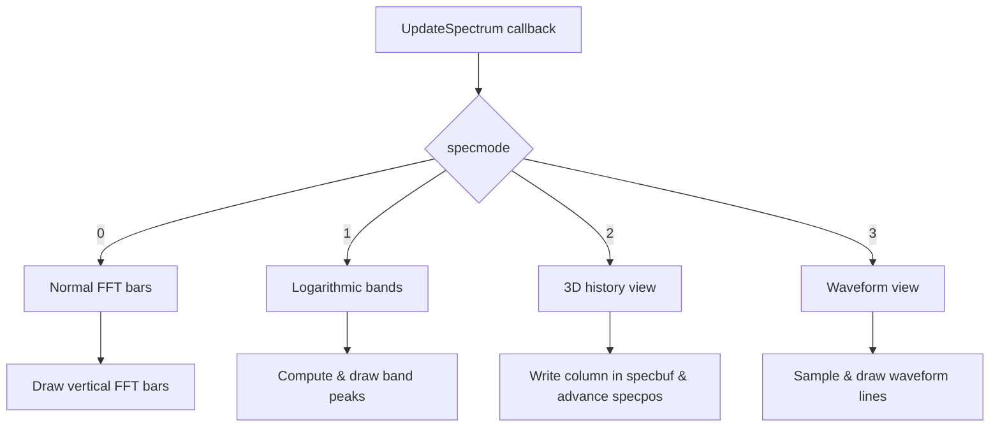

# Using the Visualizer – Visualization Modes

The visualizer renders incoming audio data in four distinct ways. You switch modes by clicking the spectrum window or by holding Shift and clicking away from the x-axis. Internally, a global integer `specmode` (0–3) controls which rendering path runs in the `UpdateSpectrum` callback.

| Mode | Name | Data Source | Purpose |
| --- | --- | --- | --- |
| 0 | Normal FFT bars | BASS_DATA_FFT2048 | Highlight frequency magnitudes as vertical bars |
| 1 | Logarithmic bands | BASS_DATA_FFT2048 | Emphasize low-frequency content via 28 bands |
| 2 | 3D History view | BASS_DATA_FFT2048 | Waterfall plot: frequency vs. time columns |
| 3 | Waveform view | BASS_DATA_FLOAT | Time-domain waveform lines per channel |


## Mode 0: Normal FFT Bars 🎚️

This is the classic bar-graph spectrum. It runs when `specmode == 0`.

- Obtains 2048-point FFT data (1024 usable floats) via:

```c
  BASS_ChannelGetData(chan, fft, BASS_DATA_FFT2048);
```

- Uses **square-root scaling** to boost low-level frequencies:

```c
  y = sqrt(fft[x+1]) * 3 * SPECHEIGHT - 4;
```

- Caps `y` to `SPECHEIGHT` and **interpolates** between frames for smoothness.
- Draws vertical bars two pixels wide across half the display width.

## Mode 1: Logarithmic Bands 📊

This mode groups frequencies into **28** bands (`#define BANDS 28`), mimicking human hearing:

- Defines band boundaries exponentially:

```c
  b1 = pow(2, x * 10.0 / (BANDS - 1));
```

- For each band, scans the FFT bins `b0…b1` to find the **peak**.
- Applies the same square-root scaling and caps to `SPECHEIGHT`.
- Draws wide bars (`SPECWIDTH/BANDS - 2` pixels) at horizontal offsets

`x * (SPECWIDTH/BANDS)`.

## Mode 2: 3D History View ⏳

A waterfall or “history” plot showing how the spectrum evolves over time:

- For each new FFT update (`specmode == 2`), treats the **vertical axis** as frequency bins.
- Computes intensity:

```c
  y = sqrt(fft[freqBin + 1]) * 3 * 127;
```

- Writes a column of intensities into `specbuf` at horizontal position `specpos`.
- Advances `specpos = (specpos + 1) % SPECWIDTH` and marks the newest column with a bright line.

## Mode 3: Waveform View 🎛️

Shows raw time-domain samples as a continuous line:

- Retrieves **floating-point samples** instead of FFT:

```c
  BASS_ChannelGetData(chan, buf, (ci.chans * SPECWIDTH * sizeof(float)) | BASS_DATA_FLOAT);
```

- For each channel and pixel `x`:
- Inverts and scales sample:

```c
    v = (1 - buf[x*ci.chans + c]) * SPECHEIGHT / 2;
```

- Caps `v` to `[0, SPECHEIGHT)`.
- Connects successive samples with lines, storing palette indices to distinguish channels

(e.g. left = green, right = red).

---



Each mode tailors the visual feedback to different monitoring needs—**Mode 0** for detailed FFT peaks, **Mode 1** for perceptual bands, **Mode 2** for temporal trends, and **Mode 3** for raw waveform inspection.